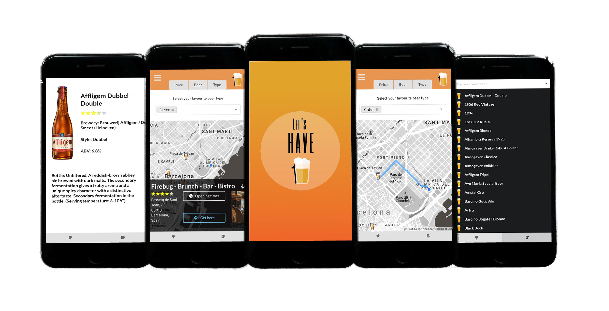

# Lets-Have-One-Front-End

<p align="center">
  
</p>

Let's Have One is a progressive web app, that helps you easily find your favorite beer in Barcelona. You can filter bars on the map by the price of the house beer, type of beer or the actual beer name. This app provides all necessary information about bars( opening hours, photos and directions), so you could find one with no effort . Additionally, you can discover world of beers in the beer information section and find you new favorite taste!

## Screenshots

<p align="center">
  
</p>

## Getting started

1. Clone the repo

```
git clone https://github.com/Gmiliuta/Lets-Have-One-client.git
cd Lets-Have-One-client
```

2. Install dependencies
```
npm install
```

3. Start development server
```
npm start
```

Please also see Back-End of this application : [Let's Have One-BackEnd](https://github.com/Gmiliuta/Lets-Have-One-server)

## Built with

* [React](https://reactjs.org) - Front end library for building user interfaces.
* [Semantic UI React](https://react.semantic-ui.com) - Semantic UI is a UI component framework for theming websites.
* [Google Maps API](https://developers.google.com/maps/documentation) - Google Maps Api creates immersive location experiences.

## Developer 
Germanas Miliuta - [GitHub](https://github.com/Gmiliuta) - [LinkedIn](https://www.linkedin.com/in/germanas-miliuta/) 
